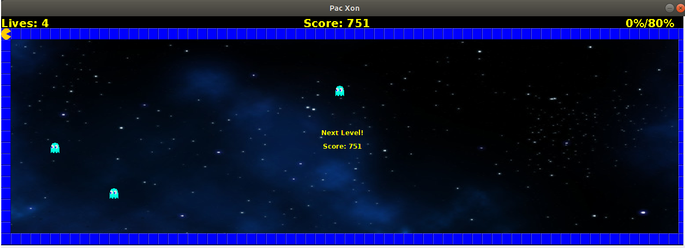

# LPOO_36 PAC XON

Our game is based on Pac Xon, a game that was inspired by Xenon and Pacman.  
The goal of the game is to reduce the space in wich the little monsters are floating until 80% of the screen is filled with walls. When a monster touches the path in construction or the player, a life is lost. After each level the difficulty increases.  
When there are no more lives, the game ends.

Made by Ana Filipa Campos Senra and Cláudia Inês da Costa Martins.

## Screenshots

 Start of the Game.   
   
 
 How the Game Begins.  
   

 Path of Construction made by the player.  
 
 
 Previous Path Filled.  
    

 Next Level Menu.  
   
 
 Game Over Menu.   
    

## Install Instructions

 To play the game, first it is required to install a Java development IDE, for example IntelliJ, and to download this project. After that, open the project this project in a suitable IDE and go to src/main/java/application and right click on the file Application.java and then click 'Run Application.java'.
