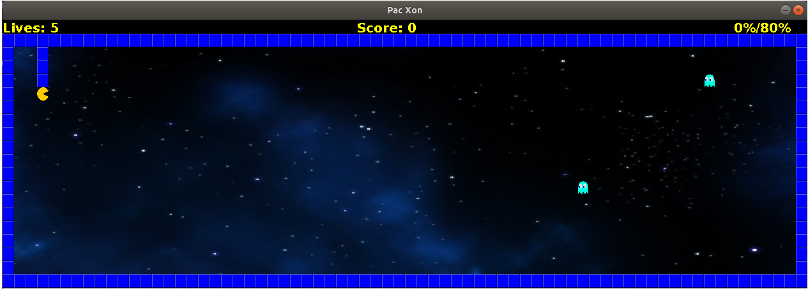
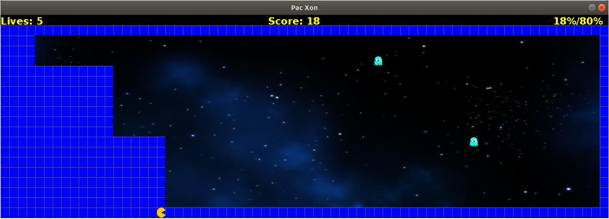

# LPOO_36 PAC XON

Our game is based on Pac Xon, a game that was inspired by Xenon and Pacman.
The goal of the game is to reduce the space in wich the little monsters are floating until 80% of the screen is filled with walls. When a monster touches the path in construction or the player, a life is lost. After each level the difficulty increases.
When there are no more lives, the game ends.

Made by Ana Filipa Campos Senra and Cláudia Inês da Costa Martins.

## Screenshots

 
 
 
  
 
 

## Install Instructions

> How can someone install the game in their computer.
