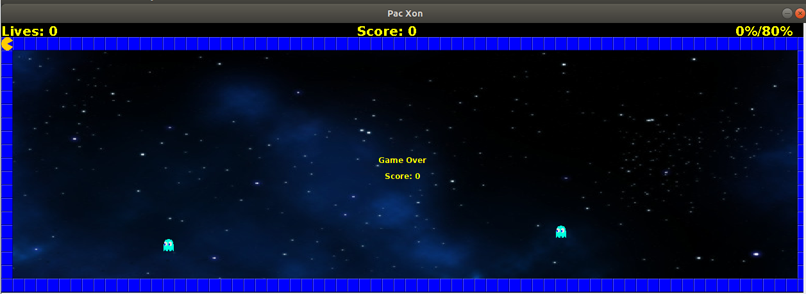

# LPOO_36 PAC XON

 Our game is based on Pac Xon, a game that was inspired by Xenon and Pacman.   
 The goal of the game is to reduce the space in wich the little monsters are floating until 80% of the screen is filled with walls. When a monster touches the path in construction or the player, a life is lost. After each level the difficulty increases.  
 When there are no more lives, the game ends. 

 Made by Ana Filipa Campos Senra and Cláudia Inês da Costa Martins.

## Implemented Features

 1. Start game: in the beginning of the game, we show to the user a start game menu, that allows the user to start the game by pressing the enter key.    
 2. Play game: once the enter key is pressed the user enters the game play section, in this section the user is a player, reperensented by a 'C', that uses all the arrow keys to move in the screen and fill the area with walls. If the player is outside the area filled with walls, the player moves continuously in the same direction according to the arrow keys that are pressed. If he is inside the blue area he moves only once per each key pressed.  
 3. Monsters: in the game area that is not yet covered with walls we have monsters moving.   
 4. Collisions: each time a monsters touches a wall or the player, we have a collision detection.  
 5. Lives: during the game execution, each time a colision occurs, the player looses a life. In the beginning of the game the player has 5 lives, everytime a level is passed he gains a live and when he reaches 0 lives he looses.
 6. Score: during the game, the score increases through levels. The points of the score are gained each time the player covers some part of the game area. The points are given accordingly to the area that is left to cover: the number of points received increase with the decrease of the area left to cover.   
 7. Percentage: to pass a level, the player has to cover 80% of the total area.  
 8. Level: everytime the player passes a level, the number of monsters increases. The game starts with only to monsters and goes up to 10.   
 9. Game over: when the player has no more lives, he looses the game, getting the final score.   
 
   
   
   

## Planned Features

> This section is similar to the previous one but should list the features that are not yet implemented. Instead of screenshots you should include GUI mock-ups for the planned features.

## Design

# THERE ARE SEVERAL DIFFERENT ITENS THAT COMPOSE THE GAME WITH SOME SIMILARITIES

# Problem in Context
 In this game we have lots of objects that compose the game area, such has the walls, the player itself, the mosnters, the background and the objects related to the game score.
 
# The Pattern
 We used the COMPOSITE pattern to structurate the code. With this pattern, the primitive objects can be composed into more complex ones wich allows us to add new types of components in a much easier way.
 
# Implementation
 We used a class called com.pac_xon.Item that was extended by six other classes: com.pac_xon.Element, com.pac_xon.Wall, Background, com.pac_xon.Score, com.pac_xon.Percentage and com.pac_xon.Lives. The com.pac_xon.Element class is also extended by the classes com.pac_xon.Monster and com.pac_xon.Player, due to the same issue.  
 
# Consequences
 With this pattern, the primitive objects, that in our case are com.pac_xon.Item and then com.pac_xon.Element, can be composed into more complex ones wich allows us to add new types of components in a much easier way.
  
  
# WE CAN ONLY HAVE ONE INSTANTION OF THE GAME CLASS

# Problem in Context
 Each time the user plays this game we can only have one instantion of the game.
 
# The Pattern
 In order to ensure that there was only one instance of the com.pac_xon.Game class we used the SINGLETON pattern in our code. 

# Implementation
 We used this pattern only in the com.pac_xon.Game class, so that when in the com.pac_xon.Application class we started a new game, it would not be possible to start a new one during all its performance.  

# Consequences
 With this pattern, we ensure that during our game execution it will only have exactly one instance. 

## Known Code Smells and Refactoring Suggestions

1. com.pac_xon.Game and com.pac_xon.Arena have too many fields (Large Class). None of the classical treatmants seem to be perfectly adequate, but moving the graphical interface to another class seems to be a possiblity. More discussion on this topic is needed.
2. The class com.pac_xon.Menu seems to be a so-called "Lazy Class". However, since we anticipated future changes to the graphic design (and we know that this may seem like a pitfall) such as adding images, suport to mouse and others, this class will be usefull in the future.

## Testing Results

> This section should contain screenshots of the main results of both the test coverage and mutation testing reports. It should also contain links to those reports in HTML format (you can copy the reports to the docs folder).

## Self-evaluation
The work was carried out by both students but not divided specifically. We talked regularly and distributily small tasks accordingly. 
