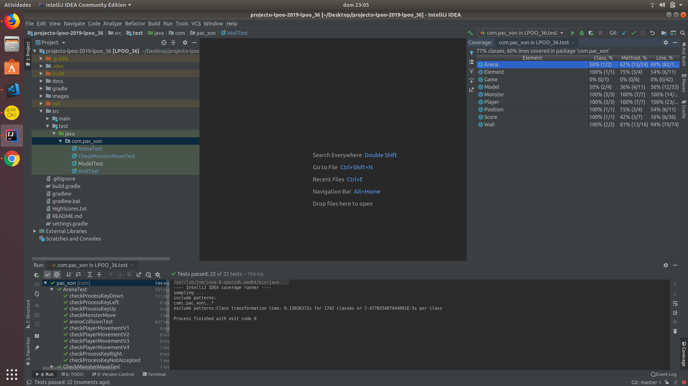

# LPOO_36 PAC XON

 Our game is based on Pac Xon, a game that was inspired by Xenon and Pacman.   
 The goal of the game is to reduce the space in wich the little monsters are floating until 80% of the screen is filled with walls. When a monster touches the path in construction or the player, a life is lost. After each level the difficulty increases.  
 When there are no more lives, the game ends. 

 Made by Ana Filipa Campos Senra and Cláudia Inês da Costa Martins.

## Implemented Features

 1. **Start game**: in the beginning of the game, we show to the user a start game menu, that allows the user to start the game by pressing the enter key or clicking in Start Game. The user can also choose to see the top 5 scores so far or to exit the game. 
 2. **Top 5 Scores**: In the Start Game Menu the user can choose to see the top 5 scores so far recorded in th game.
 3. **Play game**: once the enter key is pressed, or the Start Game Button is selected, the user enters the game play section, in this section the user is a player, reperensented by the pacman figure, that uses all the arrow keys to move in the screen and fill the area with walls. If the player is outside the area filled with walls, the player moves continuously in the same direction according to the arrow keys that are pressed. If he is inside the blue area he moves only once per each key pressed.  
 4. **Monsters**: in the game area that is not yet covered with walls we have monsters moving.   
 5. **Collisions**: each time a monsters touches a wall or the player, we have a collision detection.  
 6. **Lives**: during the game execution, each time a colision occurs, the player looses a life. In the beginning of the game the player has 5 lives, everytime a level is passed he gains a live and when he reaches 0 lives he looses.
 7. **Score**: during the game, the score increases through levels. The points of the score are gained each time the player covers some part of the game area. The points are given accordingly to the area that is left to cover: the number of points received increase with the decrease of the area left to cover.   
 8. **Percentage**: to pass a level, the player has to cover 80% of the total area.  
 9. **Level**: everytime the player passes a level, the number of monsters increases. The game starts with only two monsters and goes up to 10.   
 10. **Game over**: when the player has no more lives, he looses the game, getting the final score. If the score is in the top 5 scores, then the score is recorded.  
 
 
   
 

## Design

### THERE ARE SEVERAL DIFFERENT ITENS THAT COMPOSE THE GAME WITH SOME SIMILARITIES

### Problem in Context
 In this game we have lots of objects that compose the game area, such has the walls, the player itself, the mosnters, the background and the objects related to the game score.
 
### The Pattern
 We used the **COMPOSITE** pattern to structure the code. With this pattern, the primitive objects can be composed into more complex ones wich allows us to add new types of components in a much easier way.
 
### Implementation
 We used a class called com.pac_xon.Element class is also extended by the classes com.pac_xon.Monster and com.pac_xon.Player.
 
### Consequences
 With this pattern, the primitive objects, that in our case are com.pac_xon.Item and then com.pac_xon.Element, can be composed into more complex ones wich allows us to add new types of components in a much easier way.
 
  
  
### WE CAN ONLY HAVE ONE INSTANTION OF THE GAME CLASS

### Problem in Context
 Each time the user plays this game we can only have one instantion of the game.
 
### The Pattern
 In order to ensure that there was only one instance of the com.pac_xon.Game class we used the **SINGLETON** pattern in our code. 

### Implementation
 We used this pattern only in the com.pac_xon.Game class, so that when in the com.pac_xon.Application class we started a new game, it would not be possible to start a new one during all its performance.  

### Consequences
 With this pattern, we ensure that during our game execution it will only have exactly one instance.
 
 
 
 ### WE SHOULD RESPECT THE SINGLE RESPONSABILITY PRINCIPLE AND NOT HAVE LARGE CLASSES
 
 ### Problem in Context
 Some classes were too large and violated the single responsability principle.
 
 ### The Pattern
 In order to ensure that there was not any violation of the reffered principle and that the classes were not too large, we used **ARQUITECTURAL PATTERNS (MVC)**.
 
 ### Implementation
  We used this pattern creating a model (to represent the data) and view (to display it) class and used it to implement the game and its characters.
  
  ### Consequences
 With this pattern, we ensure that our code is well organized.

 ### WE NEED TO CONTROL THE INTERACTIONS BETWEEN THE USER AND THE GAME
 
 ### Problem in Context
  It is necessary to control the interactions that the user has with the program.
 
  ### The Pattern
 In order to ensure that the interactions were sucessfuly controlled, we used the **OBSERVER** pattern.
 
 ### Implementation
  We used this pattern in the model class to control the keys the player pressed during the game play.
  
  ### Consequences
  With this pattern, we ensure that everytime the player presses a key, the model class is notified and handles it the right way. 

## Known Code Smells and Refactoring Suggestions

All the Code Smells detected in the first deliverly were corrected:
1. com.pac_xon.Game and com.pac_xon.Arena were Large Classes. Since then, we have adopted the MVC architeture separating the View component from the Model component.
2. Since we have adopted the MVC architeture, there isn't a need for the class Menu (which seemed to be a so-called "Lazy Class").

## Testing Results
 
 
 We understand that these results are far from ideal and we plan to improve them.   
 You can find the reports [here](https://github.com/FEUP-LPOO/projecto-lpoo-2019-lpoo_36/tree/master/docs/pitest).

## Self-evaluation
The work was carried out by both students but not divided specifically. We talked regularly and distributily small tasks accordingly.   
Filipa Senra: 50%.  
Cláudia Marins: 50%.  
